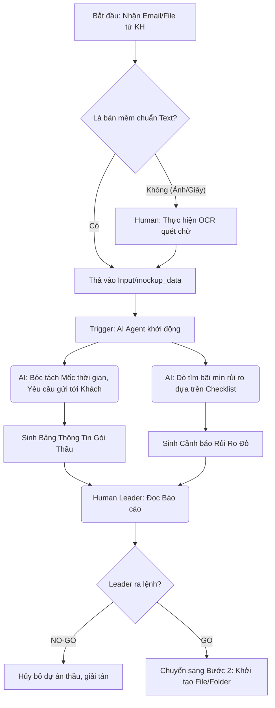

# Workflow - Luồng Xử Lý Bước 1 (Tiếp Nhận Thầu)

Luồng chạy chi tiết thể hiện điểm giao thoa giữa Người cắm mốc và Máy cày ải:

```mermaid
graph TD
    A[Bắt đầu: Nhận Email/File từ KH] --> B{Là bản mềm chuẩn Text?}
    B -- Không (Ảnh/Giấy) --> C[Human: Thực hiện OCR quét chữ]
    B -- Có --> D[Thả vào Input/mockup_data]
    C --> D
    D --> E[Trigger: AI Agent khởi động]
    E --> F(AI: Bóc tách Mốc thời gian, Yêu cầu gửi tới Khách)
    E --> G(AI: Dò tìm bãi mìn rủi ro dựa trên Checklist)
    F --> H[Sinh Bảng Thông Tin Gói Thầu]
    G --> I[Sinh Cảnh báo Rủi Ro Đỏ]
    H --> J(Human Leader: Đọc Báo cáo)
    I --> J
    J --> K{Leader ra lệnh?}
    K -- NO-GO --> L[Hủy bỏ dự án thầu, giải tán]
    K -- GO --> M[Chuyển sang Bước 2: Khởi tạo File/Folder]

```
